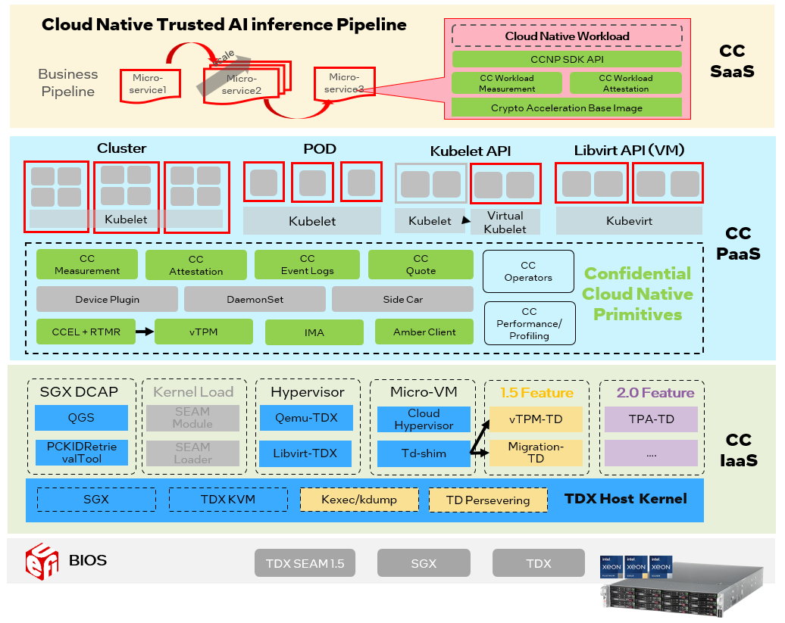

# Confidential Cloud Native Primitives (CCNP)

VM(Virtual Machine) based confidential computing like Intel TDX provides isolated encryption runtime environment based on
hardware Trusted Execution Environment (TEE) technologies. To land cloud native computing into confidential environment,
there are lots of different PaaS frameworks such as confidential cluster, confidential container, which brings challenges
for enabling and TEE measurement.
This project uses cloud native design pattern to implement confidential computing primitives like event log, measurement,
quote and attestation. It also provides new features design to address new challenges like how to auto scale trustworthy,
how to reduce TCB size, etc.

_NOTE: For Intel TDX, it bases on Linux TDX Software Stack at [tdx-tools](https://github.com/intel/tdx-tools), the corresponding white
paper is at [Whitepaper: Linux* Stacks for Intel® Trust Domain Extension 1.0](https://www.intel.com/content/www/us/en/content-details/779108/whitepaper-linux-stacks-for-intel-trust-domain-extension-1-0.html)._

**Note**: This is pre-release/prototype software and, as such, it may be substantially modified as updated versions are made available. Also, the authors make no assurance that it will ever develop or make generally available a production-ready version.
