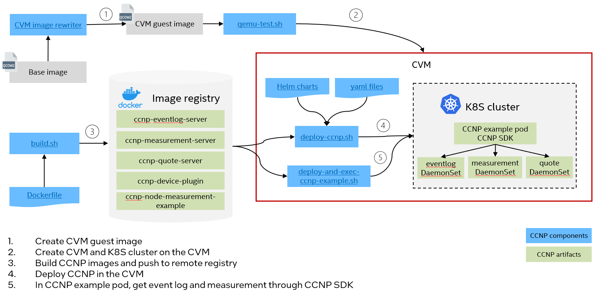

# CCNP Deployment Guide

CCNP is designed for collecting confidential computing primitives in cloud native environments. It can run as DaemonSet in a Kubernetes cluster or containers in a Docker environment on confidential virtual machines, such as Intel TDX guest(TD). 

## Create TD

Before moving forward, please make sure you have a TD booted. The CCNP service installation will happen in the TD.

You can use [cvm image rewriter](../../tools/cvm-image-rewriter/README.md) to prepare a TD enlightened guest image.

**NOTE:**
 - If your initial guest image already has a TDX kernel, it's required to run [plugin](../../tools/cvm-image-rewriter/pre-stage/) 08 and 09 to set device access permission.
 - If your initial guest image is a normal Ubuntu guest image, it's required to run [plugin](../../tools/cvm-image-rewriter/pre-stage/) 05 to install TDX kernel and then 08, 09 to set device access permission.
 
Start a TD using [qemu-test.sh](../../tools/cvm-image-rewriter/qemu-test.sh) or [start-virt.sh](../../tools/cvm-image-rewriter/start-virt.sh).

 - Use `qemu-test.sh`, please use `-q <vsock/tdvmcall>` to make sure get quote works for the TD.
    ```
    $ sudo ./qemu-test.sh -i output.qcow2 -t td -p <qemu monitor port> -f <ssh_forward port> -q tdvmcall
    ```

- Use `start-virt.sh`. The Libvirt XML template is [tdx-libvirt-ubuntu-host.xml.template](../../tools/cvm-image-rewriter/tdx-libvirt-ubuntu-host.xml.template). It uses `vsock` for getting quote.
    ```
    $ sudo ./start-virt.sh -i <guest image>
    ```

## Build CCNP images

Run script [build.sh](../container/build.sh) to generate CCNP images. It will generate 5 images and push them to user specific registry.

Learn more details in the [README.md](../../container/README.md).

_NOTE: The scripts need to run on a server with docker installed._

```
$ cd container
$ sudo ./build.sh -r <remote registry> -g <docker image tag>

e.g.

# Build images with tag 0.3 and push them to remote registry test-registry.intel.com
$ sudo ./build.sh -r test-registry.intel.com/test -g 0.3

# Build images only with tag 0.3
$ sudo ./build.sh -a build -g 0.3
```

_NOTE: please set `HTTP_PROXY`, `HTTPS_PROXY`, `NO_PROXY` in your terminal if they are needed in your environments._

After the script is successful, it's supposed to see below docker images for CCNP.

```
$ sudo docker images
ccnp-node-measurement-example   <your image tag>
ccnp-eventlog-server            <your image tag>
ccnp-measurement-server         <your image tag>
ccnp-quote-server               <your image tag>
ccnp-device-plugin              <your image tag>
```

## Deployment CCNP in Kubernetes

Below diagram illustrates CCNP deployment process in a Kubernetes cluster. If you want to install CCNP services as DamonSets in the Kubernetes cluster, please refer to [CCNP deployment in Kubernetes](./kubernetes/README.md).




## Deploy CCNP in Docker

Below diagram illustrates CCNP deployment process using docker compose. If you want to setup CCNP services as docker containers, please refer to [CCNP deployment in Docker](./docker-compose/README.md).


